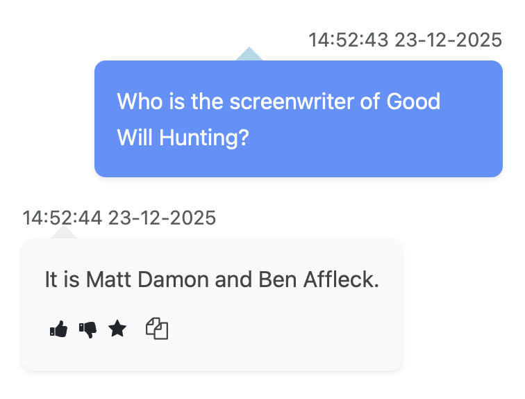
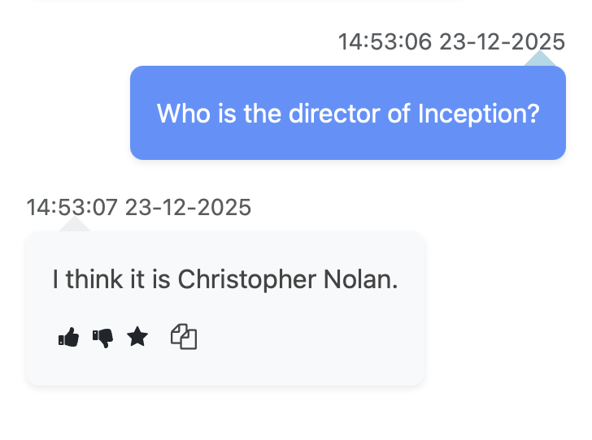
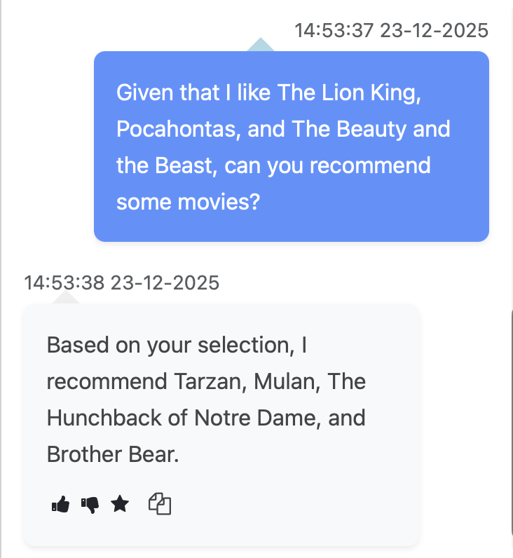
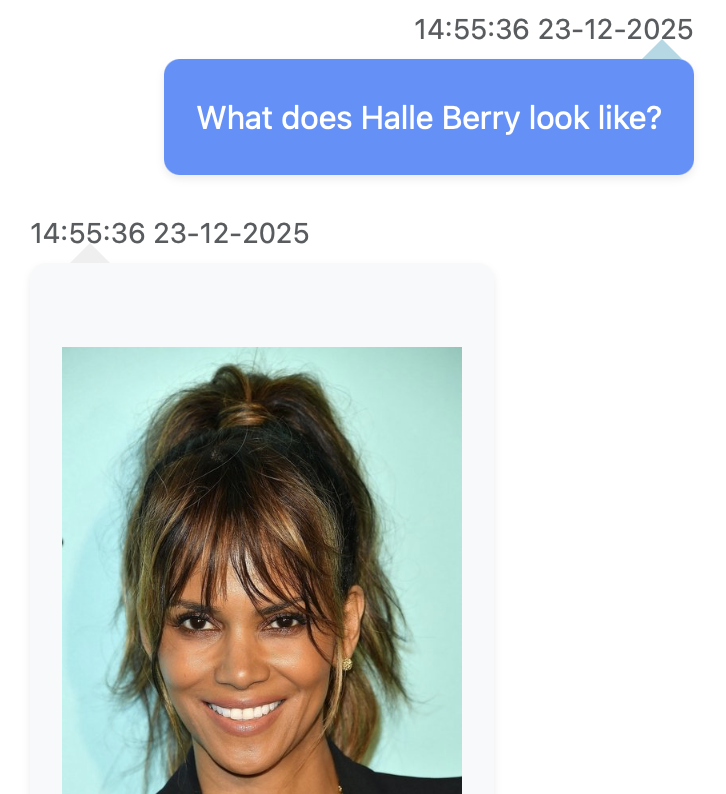

# ATAI Movie Chatbot

A specialized conversational AI agent designed to answer movie-related questions using advanced AI/ML concepts including embeddings, recommender systems, and Named Entity Recognition (NER). The chatbot runs on **Speakeasy**, an external client that provides an intuitive user interface for seamless interaction.

## System Architecture

The chatbot employs a multi-stage pipeline to process and respond to user queries:

1. **Classification**: An initial classifier analyzes incoming requests and assigns them to the appropriate request type
2. **Routing**: The classified request is forwarded to the respective processing module
3. **Entity Extraction**: A Named Entity Recognition (NER) system extracts relevant entities such as movie names, actor names, places, and dates when necessary

<p align="center">
  
</p>

## Supported Query Types

### 1. Factual Questions

The system leverages a **knowledge graph** to answer structured factual questions about movies. This includes information such as:
- Directors and crew members
- Release dates
- Genres and categories
- Cast and actors
- Production details

The knowledge graph enables fast and accurate retrieval of structured data, making it ideal for straightforward factual queries.

<p align="center">
  
</p>

### 2. Embeddings-Based Search

For factual questions that cannot be resolved through the knowledge graph, the system employs **semantic embeddings** as a fallback mechanism. 

Embeddings are dense vector representations of text that capture semantic meaning in a high-dimensional space. By converting both the query and movie-related content into embeddings, the system can:
- Measure semantic similarity between questions and answers
- Find relevant information even when exact keyword matches don't exist
- Handle complex or nuanced queries that require contextual understanding

This approach bridges the gap between structured data retrieval and natural language understanding.

<p align="center">
  
</p>

### 3. Movie Recommendations

The chatbot features a **recommender system** that suggests movies based on user preferences. Users can:
- Ask for recommendations similar to movies they've enjoyed
- Discover films based on genre, mood, or themes
- Receive personalized suggestions using collaborative and content-based filtering

The recommendation engine analyzes movie features and user preferences to deliver relevant suggestions.

<p align="center">
  
</p>

### 4. Multimedia Content

The system provides **visual content** to enhance the user experience, including:
- Movie posters and promotional images
- Actor photographs
- Scene stills and screenshots

This multimedia capability makes interactions more engaging and informative by complementing textual responses with relevant visual content.

<p align="center">
  
</p>

## Technologies Used

- **Natural Language Processing**: Entity extraction and text classification
- **Knowledge Graphs**: Structured data storage and retrieval
- **Semantic Embeddings**: Vector-based similarity search
- **Recommender Systems**: Collaborative and content-based filtering
- **Speakeasy**: External UI client for user interactions

## Getting Started

```bash
# Clone the repository
git clone <repository-url>

# Install dependencies
pip install -r requirements.txt

# Run the chatbot
python src/agent.py
```

---

*This project demonstrates the integration of multiple AI/ML techniques to create an intelligent, domain-specific conversational agent.*
